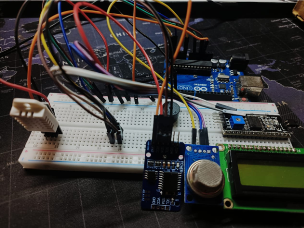

# 🌍 FreeRTOS-Based Environmental Monitoring System

A real-time environmental monitoring system using FreeRTOS on an Arduino platform. It integrates multiple sensors to measure **temperature**, **humidity**, and **air quality**, displaying the data on an LCD screen.

## Features

✅ **Temperature & Humidity Monitoring** – Uses the DHT22 sensor for accurate readings.  
✅ **Real-Time Clock (RTC)** – DS3231 keeps precise time for logging.  
✅ **Air Quality Monitoring** – MQ135 sensor detects air pollutants.  
✅ **LCD Display** – 16x2 I2C LCD for real-time data visualization.  
✅ **FreeRTOS Integration** – Efficient multitasking with semaphores.

## 📚 Documentation


## 🔧 Components

- **Arduino Uno** – The brain of the system.
- **DHT22 Sensor** – Temperature & Humidity monitoring.
- **DS3231 RTC Module** – Tracks time for data logging.
- **MQ135 Sensor** – Measures air quality.
- **16x2 I2C LCD** – Displays sensor data.

## Setup



### 1️. Hardware Connections

- **DHT22** → Pin 2
- **DS3231 RTC** → I2C (SDA, SCL)
- **MQ135** → Analog Pin (A0)
- **LCD Display** → I2C (SDA, SCL)

### 2️. Software Setup

1. Install required libraries:
   ```bash
   Arduino_FreeRTOS, RTClib, DHT, LiquidCrystal_I2C, Wire
   ```
2. Upload `Final_Code_Project.ino` to the Arduino Uno.

## 📝 Code Overview

The system is structured using FreeRTOS tasks:

🔹 **TaskReadTempHum** – Reads temperature & humidity.  
🔹 **TaskReadRTC** – Reads real-time clock data.  
🔹 **TaskReadMQ135** – Reads air quality values.  
🔹 **TaskPrintVal** – Displays sensor data on the LCD.


### 📌 **Why FreeRTOS?**

- **Multitasking** – Runs sensor readings simultaneously.
- **Semaphores** – Prevents race conditions in data access.
- **Efficiency** – Proper task scheduling ensures no resource conflicts.

## 📊 Results & Analysis

✅ **Real-time Data Display** – Serial monitor & LCD show live updates.  
✅ **Precise AQI (Air Quality Index)** – Detects pollutants using MQ135.  
✅ **Accurate Timestamps** – RTC logs each reading.  
✅ **Efficient Task Scheduling** – FreeRTOS prevents delays & conflicts.

### 📌 **Challenges & Solutions**

🚧 **I2C Communication Issues** – Fixed using proper pull-up resistors.  
🚧 **MQ135 Calibration** – Requires 5-10 min warm-up for accurate readings.  
🚧 **Memory Constraints** – Optimized task prioritization to prevent overflows.

## Authors

👨‍💻 **Sarthak Kotia**  
👨‍💻 **Saransh Kathal**

## Acknowledgments

Special thanks to **Arduino**, **Adafruit**, and the **open-source community** for their incredible resources.
